# Patch notes
## New Features
**New control scheme: Quickfire**
  - ~~Stolen~~ Used with permission from TheyCallMeXander's SA-X Duels. Beams, missiles, and supers all have their own button. Power bombs are deployed with the missile button.
   
**New SA-X Mechanic: Save-Ending**
  - Once the SA-X team has eliminated all Fusion players, they must find a save station in order to complete their win. This was implemented to prevent situations where the game would end as a SA-X win automatically due to bugs or Fusion crashes.

**Players can see the item inside the Core-X**
  - No longer do people need to memorize a table of colors or what color Zazabi was, now the items can optionally be seen on the Core-X itself. Enabled through a setting in Display Options.

**Major item snychronization and granular control of starting tanks**
  - If you're downloading this you're probably aware by now of the ItemSyncs mod, but I'm noting it anyway.
  - Allows the host to set up major items so that either both teams start with it, only the SA-X starts with it, or that neither team starts with it and when grabbed, both teams get it.
  - Also allows the host to specify how many of each tank type each team starts wil.

**Revive button**
  - Allows the host to revive a dead, unpaused player by pressing the button next to their name in the server. Pausing the lobby is no longer required.

**Client-side kick reasons**
  - When kicked, the client will now display the reason for it. The possible reasons are as follows:
    - Kicked by host
    - Kicked - Version Mismatch
    - Kicked - Buffer Overflow
    - Kicked from Server (if the server provides an unknown reason for being kicked)

**F4 stops the currently playing music**
  - It likes to get stuck playing because oMusicV2 is evil.

**Server themes**
  - Instead of just light gray, you can now also have a dark bluish gray and black background.

**Server settings get saved per-mode between restarts**
  - When closing the server or switching mode, it will save the settings and use those on startup.

**Turned Experimental settings into its own menu**
  - After itemsyncs were added, the Experimetnal toggle had no use, so it got replaced with the shortcut toggle. But we started having ideas of things we wanted to try, so instead of a toggle we gave it a full menu where individual settings could be edited.
  - Currently, the only setting in there is teh ability to disable rollback gits, but more will be added in the future!

**Septoggs are now killable!**
  - Someone tell M3D

## Balance changes
**Core-X absorbs no longer freeze you in place**
  - This had the ability to kill your speed boosts and softlock you on elevators, so it was removed.
   
**All health drops are 20 HP**
  - Farming for health was a laborious process and slowed down the game more than anything else.
   
**EMP doors open as soon as the battery is in place**
  - TODO: write non-dismissive description text
   
**The Tower's Power Switch and the Distribution Center's EMP Switch activate as soon as samus rolls into place**
  - The long wait for these switches to activate meant that activating them while in chase was a death sentence.

**SA-X map starts out gray**
  - The SA-X map always being filled made it hard to tell where you and your teammates had been, and especially affected non-experimental games.
  - TODO: make metroids properly display on the SA-X map

**Mebits die in one ice missile**
  - Previously it would take one missile to freeze it, and then one or two more to kill it. It meant farming them wasn't an option since you'd at best not gain or lose missiles, if every drop was a green X.

### Spectator
**All rooms are always fully illuminated**
  - Previously, if a spectator teleported out of a dark room, it was very difficult to set the light level to normal again. Thank you BastionB56 for coding this!

**Block that only spectators can break**
  - Currently unused, but I wanted to leave it in the notes for any people trying to build SA-X based mods on 1.9 and later. It may also see use in later updates.

## Map changes
Note: All shortcuts added by 1.9 can be toggled in the server, so you can have them in co-op or not in SA-X if you want. It's where the Experimental toggle used to be.

**Main Caves**
  - Added a one-way pipe above the Entrance to Area 3, you can open it with a missile!

    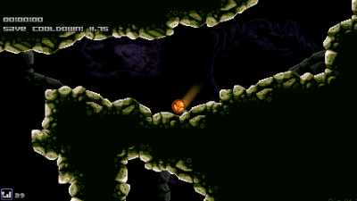
  - Added a hiding spot in the A3 entrance maze, you cannot open it with a missile!

    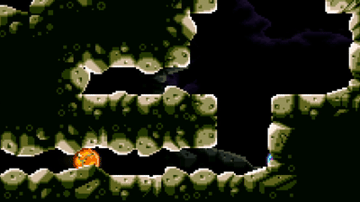
  - Added a screw-locked shortcut from the U-bend room near First Alpha to the A2 EMP Ball room.
  - Added a speed-locked shortcut from the large drop near A4 to the Alpha Metroid in Mines.
  - Added a screw-locked shortcut between the cave with the shinespark item and the top right Gamma metroid.

**Golden Temple - A1**
  - Added a power bomb-locked elevator between the A1 Gawron tunnel and the right side of GFS Thoth.

      
    Thanks to Haihaa for the example image.
  - Added a crumble block shortcut from the Spiderball cave to inside A1.

    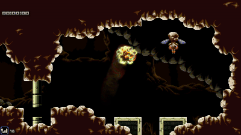

**Hydro Station - A2**
  - Modified the layout of the breeding grounds missile room to allow for an exit through the Speed Booster entrance.
  - Added a speed-locked shortcut from A2 exterior to the Main Caves crossroads.
  - Added a screw-locked shortcut between the deepest Alpha in BG2 and the A4 exterior top-left.
  - Added a super missile-locked shortcut from the BG2 crossroads to the top of the Omega Nest shaft.
  - Added a missile-locked shortcut from A2 interior's top Alpha to the hole in the wall.

    
  - Added a fadetile where the A2 jumpscare Alpha emerges from.

    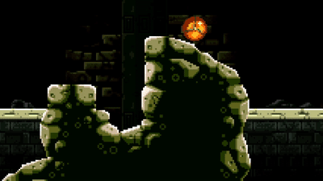
  - Remodellers adjusted the A2 entrance area to be ADA compliant with a convenient slope.

    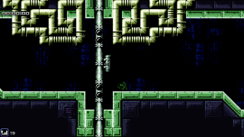

**Industrial Complex - A3**
  - Added a speed-locked shortcut from deep A3 "the one I never want to hear about again" to the BG3 room before the final Gamma metroid.
  - Added a screw-locked pipe between deep A3 "the one I never want to hear about again" and the A1 EMP Ball room.
  - Added a screw-locked pipe between BG3 and the A4 exterior top-right.
  - Added one-way missile shortcuts to not require players to build speed in combat.

    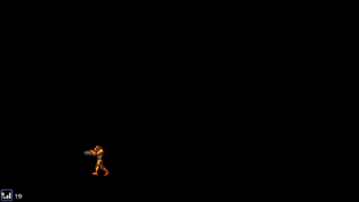
    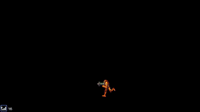
  - Added a missile shortcut into the deep A3 morph tunnels.

    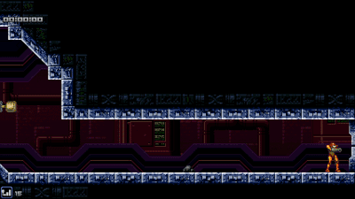
  - Added an alternate path out the bottom of the deep A3 morph tunnels.

    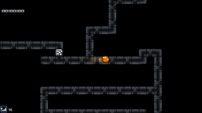
  - Added power bomb blocks to allow players to skip Skippy.

    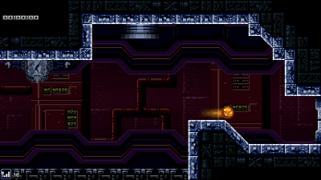

**Distribution Center - A5**
  - Added a one-way missile shortcut to not require players to build speed in combat.

    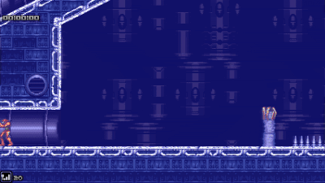

**Deep Caves - A6**
  - Added a side path through the chokepoint room with the Meboid.

    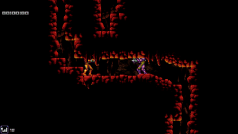
  - Added a path of shot blocks through the speed shortcut under the first Deep Caves save station.
    - This prevents an exploit where SA-X Core-X could go into the shortcut and hide in the speed blocks for an easy escape.
  - Added a screw-locked pipe between the room at the right side of the A6 loop and the room to the right of the shinespark tunnel in Omega Nest.

**Omega Nest - A7**
  - Added a path of shot blocks through the speed shortcut in the vertical shaft leading to the save station.
    - This prevents an exploit where SA-X Core-X could go into the shortcut and hide in the speed blocks for an easy escape.
  - Added a bomb-locked shortcut between the top and bottom left Omega leadup rooms.
  - Added a power bomb-locked shortcut from the middle Omega to the A4 top-left Gamma.

## Bug fixes
  - Changed the config location to prevent issues with new settings.
  - Add some default values to prevent crashes.
  - Made some screw attack blocks stop appearing when you don't have screw attack to prevent getting trapped.
  - Allow players to pick up items if they stopped being a spectator/Core-X without resetting the room.
  - Fix the one missing screw block in the Bullet Hell room.
  - Scrub newline characters from usernames when they get set.
  - The credits can now be skipped if the user is connected to a server.
  - Fixed the Thoth elevator softlock related to pausing.
  - Players can no longer repeat actions by getting frozen with precise timing.
  - Fixed spectators causing map icons to not be drawn during Doomsday.
  - Spectators will no longer try to sync various things about their gamestate. This fixes spectators dropping and refilling the Fusion team's energy tanks and ammo.
  - Serris is now triggered by grabbing its item instead of having it. Primarily a fix for Itemsyncs where players could unknowingly be forced to fight her.
  - The blockade stopping you from going to Queen after she dies no longer spawns in co-op mode. Thanks to Variable for making this so I could forget about it and re-do the work.
  - Fixed the kick and ban buttons to properly handle connections coming from the same IP.
  - Improved fadetiles for developers (Thanks to TheyCallMeDangerIMeanXander for this).
  - Add background tiles in the surface rooms at night.
  - Having the in-game timer disabled no longer breaks pausing logic.
  - The SA-X Mode round timer no longer ticks during the unpause countdown.